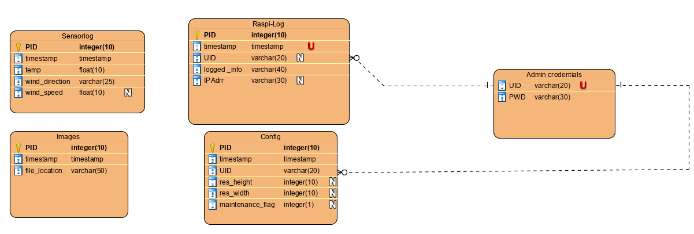

= Design Documentation
Justin Schirdewahn <s78808@htw-dresden.de>;
0.1, 28.02.2020 
:toc: 
:toc-title: Inhaltsverzeichnis
:sectnums:

== Entity-Relationship-Modell
In dem von uns erstelltem ERM wird der Aufbau der Datenbank dargestellt, welche später für die Verarbeitung der Daten essenziell wichtig ist. Jede Tabelle besitzt eine Primary Key ID (kurz PID), welche zur eindeutigen Identifizierung der Daten dient und unabhängig von diesen erstellt wird. Die Tabellen 'Raspi-Log' und 'Config' besitzen jewiels einen Fremdschlüssel auf die UID der Tabelle 'Admin-Credentials'.
[#img01]
