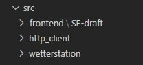
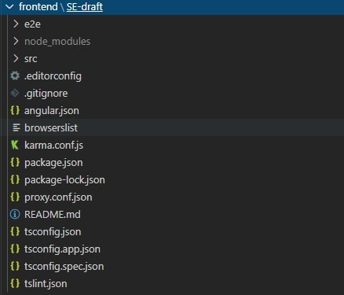
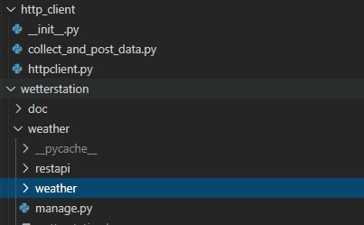

:toc:
:toclevels: 3
:toc-title: Inhaltsverzeichnis
:sectanchors:
:numbered:

toc::[]

= Betriebsdokumentation
Autoren: Justin Schirdewahn

== Systemanforderungen

=== Mindestanforderungen
Der Raspberry Pi muss eine stabile Internetverbindung für die Datenübertragung aufbauen können. Hardwareanforderungen für Ubuntu 18.04 Server-Edition sind mindestens ein 300MHz Prozessor, 256 MB Arbeitsspeicher und 1,5 GB Datenspeicher. Es werden keine Grafikanforderungen benötigt, da per Remote auf den Raspberry Pi zugegriffen wird.

=== Softwareanforderungen
Das System läuft mit Ubuntu 18.04 als Betriebssystem auf einem Apache 2.4 Webserver. Für die Datenbank wird eine MySQL Datenbank verwendet. Das Frontend wurde unter Chrome 84.0.41.47.105 auf seine Funktionsfähigkeit getestet.

== Systemeinrichtung

=== Komponenten
Verwendete Komponenten im System sind zu großen Teilen TypeScript (42.0% Anteil) und Python (35.1% Anteil). Desweiteren wurden HTML, CSS und JavaScript verwendet. +
Auf Komponententeile wie JAR oder EXE Formartierungen wurde verzichtet.

=== Verzeichnisstruktur
Die Quelldateien liegen unter dem Ordner 'src'. Unter diesem Ordner werden die Dateien in Frontend 'frontend/SE-draft' und Backend 'http_client, wetterstation/weather' gegliedert. +
 +
Das Frontend besitzt eine Angular Verzeichnisstruktur. Unter https://angular.io/guide/architecture[Angular Aufbau] können mehr Informationen zum Aufbau eines Angular Projektes gefunden werden. +
 +
Das Backend ist in zwei Teile gegliedert. In 'http_client' und 'wetterstation/weather'. +
 +
Unter 'http_client' liegen die Scripte, welche für das Versenden von Daten zuständig sind. +
Unter 'wetterstation' liegt die Logik des Systems. Hier werden die Daten, welche vom Raspberry Pi versand werden an die Datenbankstruktur angepasst, für die Verarbeitung im Frontend aufbereitet und die Funktionalität des Administrationsbereiches definiert und sichergestellt. Es wird die Struktur eines Django Projektes verwendet. Um mehr über die Struktur zu erfahren geht es hier zur https://docs.djangoproject.com/en/3.0/ref/[Dokumentation].

=== Installation
Die Scripte, welche unter 'src/http_client' liegen müssen auf den Raspberry Pi kopiert werden. +
Das Frontend muss in den Apache Webserver eingebunden werden. In der lokalen Entwicklungsumgebung, im Root-Verzeichnis des Projektes muss der Befehl 'ng build --prod' ausgeführt werden. Der Befehl erstellt einen Ordner der 'dist' heißt. Die Dateien, die in diesem Ordner liegen müssen in das Root-Verzeichnis des Apache Servers kopiert werden. +
Genauer Informationen stehen unter https://angular.io/guide/deployment[Angular API] zur Verfügung.

=== Konfigurationsdaten
.IP-Adressen
|===
|IP-Adresse|Referenz-Objekt
|79.254.12.239
|Raspberry Pi

|80.158.40.211
|Datenbank
|===
.Passwörter
|===
|Passwörter|Berechtigungen
|Bei Erstellung von Admin 'python manage.py createsuperuser' definiert
|Webserver Adminbereich

|wth1984_
|Zugriff auf Raspi

|Wth1984_DB
|Zugriff auf Datenbank
|===

== Systembetreuung

=== FAQ
- Fragen
- Antworten

Nochmal schön in Tabelle machen

Beim Meeting besprechen!

=== Fehlerdiagnose
Im Meeting besprechen!

=== Datensicherung
Im Meeting besprechen!

=== Links
https://angular.io/docs +
https://docs.python.org/3/library/ +
https://www.django-rest-framework.org/api-guide/requests/ +
https://docs.djangoproject.com/en/3.0/ref/ +
https://dev.mysql.com/doc/
