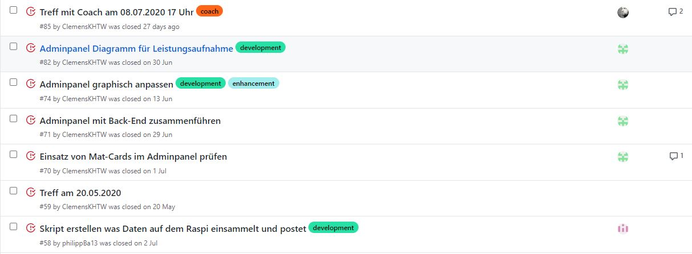
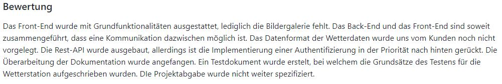

= Wesentliche Entscheidungen
Autoren: Clemens Kujus, Alexander Schoch

== Rollenverteilung
Die Rollenverteilung hat sich 2 mal grob verändert. Zum einen am Anfang des Projekts, als unser ehemaliger Projektmanager Martin Großmann seine Rolle abgegeben hat. Er hat sich in seiner Rolle nicht wohlgefühlt und ist seinen Aufgaben in den ersten beiden Projektwochen auch nicht nachgekommen. Auf anraten des Teams und schließlich eigener Entscheidung trat er seine Position ab. Getauscht wurde mit Clemens Kujus, dem damaligen Tester. Somit wurde Martin primär Tester und Backup-Projektmanager. Diese Konstellation hat sich bis durch das WiSe 20 gehalten, für das SoSe 20 entschied sich Martin allerdings das Projekt zu verlassen. Neu hinzugekommen ist Hannes Fogut, der die Rolle des Testers von Martin übernommen hat, und sich aufgrund der großen Implementieraufgaben auch als Entwickler gemeldet hat. Damit wurde Alexander Schoch Backup-Projektmanager. Durch den Wegfall von Martin Großmann und das Hinzukommen von Hannes Fogut hat das Projekt an Qualität und Produktivität gewonnen.

Neben der Rollenverteilung nach dem OpenUP haben wir uns vor allem mit der Phase der Implementierung dafür entschieden, dass mehrere Teammitglieder auch abseits ihrer UP-Rolle teaminterne Rollen haben, die vor allem der Unterstützung der Entwickler dienen. So wurde z.B. der Projektmanager nebenläufig zum Front-End Entwickler. Aufgrund der Komplexität der Software war dies auch richtig und nötig.

== Nutzung von GitHub zur Projektverwaltung
In unserem Projekt dient Git nicht nur der Versions-, sondern auch der Projektverwaltung. Das bedeutet, dass wir GitHub-Issues und im Verlauf des Projekts auch GitHub-Projekte eingeführt haben. Die Entscheidung für GitHub-Issues liegt darin begründet, dass diese eine übersichtliche und intuitive Möglichkeit bilden, Aufgaben bzw. Work Items anzubieten und die Bearbeitung kenntlich zu machen, damit zum einen Aufgaben klar definiert sind und zum anderen keine doppelte Aufgabenlösung entsteht.

.GitHub-Issues

Für die Projekte in GitHub haben wir uns entschieden, damit wir die Iterationen besser auswerten können. Eingeführt wurden sie Ende Januar 2020 auf anraten des Coaches, da die Auswertung der Iterationen bis dahin in Textform der thematisierten Iteration angeheftet wurde. Dadurch wurde zwar auch ersichtlich, welche Aufgaben wie gelöst wurden, allerdings ist ein Blocktext nicht schnell zu erfassen und Issues und Auswertung liefen parallel. In den Projekten haben wir uns aufgrund der Intuitivität für das "Basic kanban"-Template entscheiden. Die Auswertung in Textform liefen auf Entscheidung des Projektmanagers (besserer Abschluss der Iterationspläne) bis zur 13. Iteration parallel zu den Projekten. Ab der 14. Iteration haben wir uns dann allerdings dafür entschieden, wie vom Coach angeraten nur noch die Projekte zur Auswertung zu nutzen.

.Alte Auswertung in Textform

.Neue Auswertung in GitHub-Projekten
image::./images/git-projekte.jpg[] 

Wir haben uns nicht aktiv gegen die Nutzung anderer Tools entschieden, sondern haben uns auf die Notwendigkeit dieser konzentriert. Für unseren Arbeitsablauf waren die Möglichkeiten in Git völlig ausreichend, weshalb wir ausschließlich die GitHub Standardtools gewählt haben.

== Arbeit mit Git-Branches und Commitabstände
Für Git-Branches haben wir uns entschieden, da in der Implementierung Versionskonflikte abzusehen waren. Aufgrund des unten beschriebenen Problems der <<Git-Branches und Commitabstände>> setzten wir detaillierte Branches mit möglichst kleinen Commits ein.

== Regelmäßige Treffen im Team und mit den Kunden
Im WiSe 19/20 haben wir uns jeweils zum Iterationsabschluss getroffen, oft auch mit den Kunden. Mit Anfang der Implementierung haben wir dann festgestellt, dass diese Vorgehensweise zum einen zur teaminternen Kommunikation einfach nicht mehr ausreicht, zum anderen aber auch durch die oft geänderten Anforderungen der Kunden nicht mehr reicht. Demzufolge haben wir uns ab Mitte April wöchentlich online getroffen, später teilweise auch unter den Meetings persönlich, und dabei immer die Kunden eingeladen. Letztlich war diese Entscheidung maßgeblich für das Projekt und aus unserer Sicht und der der Kunden absolut richtig.

== Agile und iterativ-inkrementelle Vorgehensweise
Wir haben uns für den Ansatz des selbstorganisierenden Teams entschieden, da wir zum einen die Interessen jedes Mitglieds beachten wollten und zum anderen eine Schätzung von Aufwand und Zeit zum gegebenen Umfang schwieriger erschien als den Rahmen (Iterationen) festzulegen und die Aufgaben nach Priorität abzuarbeiten.

Für die iterativ-inkrementelle Vorgehensweise nach dem Vorbild des OpenUP haben wir uns aufgrund des Fokus im Modul Software Engineerig 1 und des Status als state of the art entschieden. Anfangs haben wir sehr strikt darauf geachtet, dass die Rollen auch möglichst nur ihre zugehörigen Aufgaben wahrnehmen. Da uns allerdings auffiel, dass dadurch ein starkes Ungleichgewicht vor allem bei der Implementierung entstehen würde, haben wir uns letztendlich für eine teainterne Rollenverteilung entschieden, bei der jeder nach seinen Stärken und Interessen auch andere unterstützende Aufgaben wahrgenommen hat.

////
Josefin Hähne: Analyst, Architekt
Philipp Barth: Architekt, Entwickler
Justin Schirdewahn: Entwickler, Tester
Alexander Schoch: Entwickler, Projektmanager
Clemens Kujus: Projektmanager, Analyst
Agustin Calvimontes: Deployment Engineer, Technical Writer
Hannes Fogut: Tester, Entwickler
////

== Angular als Framework für das Front-End
Autoren: Alexander Schoch
Für die Entwicklung des Frontends haben wir uns für Angular entschieden. Von den Kunden war die Entwicklung einer Webapplikation gewünscht. Angular ist eines der größten JavaScript Frameworks, wird fortlaufend weiterentwickelt, bietet eine komponentenbasierte Model View Controller Architektur und eine ausführliche Dokumentation. Ebenso die hohe Stabilität des Frameworks

== Django als Webframework für das Back-End
In der Anforderungsspezifikation wurde die Entwicklung eines Back-Ends auf Grundlage einer Skriptsprache gewünscht. Wir haben uns für django und das django REST framework entschieden. Diese basieren auf der Programmiersprache Python mit der einige der Entwickler schon erste Erfahrungen sammeln konnten. Des Weiteren kommt django mit einer Vielzahl von Paketen für das Entwickeln von performanten und effizienten Webanwendungen.
Ein weiterer Vorteil war der eingebaute Support für fast alle Datenbanksysteme, der uns die Integration der vom Kunden gewünschten mySQL-Datenbank vereinfachte. Django bot zudem einen hohen Sicherheitsstandard an. Während man bei der Entwicklung in PHP einen hohen Wissensstand und Erfahrung mit dieser Sprache braucht (die keiner von uns hatte), bot bereits django's integriertes Authentifizerungsframework eine hohe Sicherheit.
= Aufgetretene Probleme
Autoren: Clemens Kujus

== Aufgabenverteilung
Die Aufgabenverteilung war am Anfang des Projekts so geplant, dass sich jeder aus einem Aufgabenpool (im Iterationsplan) seine Work Items rauszieht, Issues anlegt und bearbeitet. Das hat geklappt, auch wenn der ein oder andere sich erst nach Aufforderung Aufgaben rausgesucht hat. Nach der Projektpause Februar/März 2020 lief diese Methode allerdings nur noch sehr schwer an. Die Kenntlichmachung der gerade bearbeiteten Aufgaben wurden kaum vorgenommen, ebenso das Anlegen von Issues. Als ein Grund dafür ist sicherlich die etwas unübersichtliche Situation allgemein und im Hochschulbetrieb zu nennen, zum anderen die in den Iterationsplänen bis dahin ungenaue Rollenzuweisung.

Die Gegenmaßnahmen gegen die unzureichende Aufgabenverteilung wurden der Risk-List entnommen. Zum einen haben wir uns ab Mai öfter getroffen, meist wöchentlich (auch mit Kunden). Außerdem hat der Projektmanager Ende April/Anfang Mai die Aufgaben verteilt, damit jeder genau weiß was er bis wann zu erledigen hat. Da diese Aufgabenzuweisung allerdings unserer eher agilen Arbeitsweise widerspricht, wurde sie im Interesse aller nicht weiter fortgeführt. Des Weiteren wurde nun in den Iterationsplänen bei der Planung eine vorläufige Aufgabenverteilung vorgenommen, damit jeder schon mal seine auf ihn zugeschnittenen Aufgaben sieht.

.Vorläufige Aufgabenverteilung in den Iterationsplänen
image::./images/iteration_aufgabenverteilung.jpg[]

== Git-Branches und Commitabstände
Für die Anforderungserhebnung und den Entwurf (Inception-/Elaborationphase) wurde hauptsächlich auf dem master-Branch in Git gearbeitet. Dies hat ausreichend gut funktioniert, da die Aufgaben voneinander getrennt lösbar waren, d.h. wenn einer an einem Use-Case gearbeitet hat konnte ein anderer ohne Versionskonflikte erwarten zu müssen am Architecture Notebook arbeiten. Dadurch waren auch große Commits mit vielen Änderungen möglich, da die zu bearbeitenden Dokumente im Vorhinein ersichtlich waren.

Mit dem Anfang der Implementierung war es allerdings abzusehen dass diese Vorgehensweise nicht lange gut geht, weshalb wir uns für die Arbeit auf verschiedenen (vorerst allgemeinen) Branches wie "projectmanagement" und "frontend" entschieden haben. Auf dem master-Branch sollten nur lauffähige Versionen liegen, was durch Pull-Requests und damit einem 4-Augen-Prinzip sichergestellt werden sollte. 

Das Problem der Branches war die Allgemeinheit. Ein Branch "frontend" beinhaltet die Arbeit am gesamten Front-End, was merge-Konflikte geradezu provoziert. Große Commits haben es außerdem sehr erschwert, den Code nachzuvollziehen. In einem Gastvortrag  im Modul "Geschäftsprozessmodellierung" wurde nebenläufig eine Arbeitsweise in der Softwareenwicklung vorgestellt, die auf möglichst kleine Änderungen zum nächsten build setzt. Diese Vorgehensweise haben wir versucht zu adaptieren, indem wir möglichst detaillierte Branches und möglichst kleine Commits einsetzten. Dadurch hat sich die Frequenz an neuen Funktionalitäten im lauffähigen master-Branch erhöht und damit die Präsentation der Zwischenstände dem Kunden gegenüber vereinfacht, die Nachvollziehbarkeit der Commits ist gestiegen und die Anzahl an merge-Konflikten ist sehr gering, bzw. sind diese oft einfach zu beheben.

== Vorstellungen und Ideen der Kunden
Im Verlaufe des Projekts, und vor allem gegen Ende, haben sich die Vorstellungen der Kunden oft geändert. Zum einen in erleichternde Art und Weise, z.B. wurde uns die Datenakquise von den Sensoren abgenommen und das Datenvolumen der mobilen Internetverbindung wird an unsere Bedürfnisse angepasst. Zum anderen gab es allerdings auch durchaus widersprüchliche und erschwerende Anforderungen. So wurde uns z.B. an einem Meeting die Abkehr von PHP freigestellt, beim nächsten Meeting sollte wir (trotz vorangegangener Entwicklung) den Einsatz von PHP dann wieder in Betracht ziehen. Auch wurde teilweise auf in unserer Entwicklung nicht benötigte Implementierungen bestanden. Unsere Meinung zu diesen Vorstellungen und Eingriffen in unsere Entwicklungsarbeit haben wir dann immer wieder in Treffen deutlich gemacht und natürlich auch unter Berücksichtigung der Kundenwünsche so umgesetzt, dass ein sinnvoller Arbeitsablauf möglich war.

Ein größeres Problem waren die stetig wachsenden Anforderungen und Änderungen. Diese sind vor allem dem Umstand geschuldet, dass die Wetterstation vom Kunden parallel zu unserer Wetterstation-Software gebaut wurde. Dadurch waren diverse Messwerte und Messgrößen der Sensoren bis einige Tage vor Projektende nicht bekannt. Einige Features wurden und werden daher nach offizieller Abgabe der Software am 31.07.2020 freiwillig noch weiter bearbeitet, damit am Ende auch ein sinnvoller Realberieb möglich ist.

== Mangelnde Erfahrung in der Entwicklung mit Angular
Autor: Alexander Schoch

Ein Problem in der Entwicklung des Front-End war die fehlende Erfahrung im Umgang mit Angular. Keiner von uns hat zuvor eine Webapplikation entwickelt oder mit Typescript und Angular gearbeitet. Da von Anfang an mit großen Datenmengen und einer späteren Weiterentwicklung der Wetterstation zu rechnen war (durch z.B. weitere Sensoren), wäre ein Umstieg auf ein anderes Framework oder Bibliothek wie React oder Vue wenig sinnvoll gewesen. Wir mussten uns alles nötige zeitaufwändig aneignen und best-practices lernen. Angular hat zwar eine steile Lernkurve der Workload durch die sich ständig ändernden Kundenwünsche und Anforderungen war dennoch sehr hoch, weshalb Clemens Kujus bei der Implementierung mithalf und die Arbeit erleichterte.