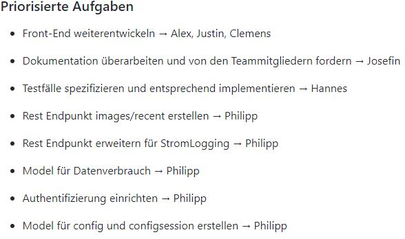

= Wesentliche Entscheidungen

== Angular als Framework für das Front-End
Autoren: Alexander Schoch

Für die Entwicklung des Frontends haben wir uns für Angular entschieden. Von den Kunden war die Entwicklung einer Webapplikation gewünscht. Angular ist eines der größten JavaScript Frameworks, wird fortlaufend weiterentwickelt, bietet eine komponentenbasierte Model View Controller Architektur und eine ausführliche Dokumentation. Ebenso die hohe Stabilität des Frameworks

=== Chart.js für die Darstellung der Graphen

Um die Graphen darzustellen haben wir uns für die kostenlose, Open-Source JavaScript Bibliothek chart.js entschieden. Sie ist zwar nicht so flexibel und umfangreich wie z.B. die Bibliothek D3, ist aber deutlich einsteigerfreundlicher und bietet eine mehr als ausreichende Dokumentation. Chart.js hat somit unseren Funktionsansprüchen mehr als genügt und sich mit seinem flachen, einfachen Design in die Material Design UI gut eingefügt. 

=== ngx-gallery für die Galerie und Lightbox

Ursprünglich war die selbstständige Entwicklung einer Galerie geplant. Da der Aufwand für die Implementierung jedoch sehr groß gewesen wäre, haben wir die Angular Bibliothek ngx-gallery verwendet.

=== Angular-JWT für die Authentifizierung

Da die API unseres Back-Ends hauptsächlich im JSON-Format mit dem Front-End kommuniziert haben wir uns für die Implementierung einer tokenbasierten Authentifizierung mit Angular-JWT entschieden. JWT (JSON Web Tokens) sind ein Industriestandard für die Generierung von Tokens. Die Verwendung von JSON Web Tokens ist zustandslos und daher sicherer als die Verwendung von Session-Variablen und Cookies. Ein weiterer Vorteil ist die hohe Zuverlässigkeit bei gleichzeitiger Minimierung des Netzwerk-Overheads.

== Django als Webframework für das Back-End
In der Anforderungsspezifikation wurde die Entwicklung eines Back-Ends auf Grundlage einer Skriptsprache gewünscht. Wir haben uns für Django und das Django REST Framework entschieden. Diese basieren auf der Programmiersprache Python mit der einige der Entwickler schon erste Erfahrungen sammeln konnten. Des Weiteren kommt Django mit einer Vielzahl von Paketen für das Entwickeln von performanten und effizienten Webanwendungen.
Ein weiterer Vorteil war der eingebaute Support für fast alle Datenbanksysteme, der uns die Integration der vom Kunden gewünschten mySQL-Datenbank vereinfachte. Django bot zudem einen hohen Sicherheitsstandard an. Während man bei der Entwicklung in PHP einen hohen Wissensstand und Erfahrung mit dieser Sprache braucht (die keiner von uns hatte), bot bereits Django's integriertes Authentifizierungsframework eine hohe Sicherheit.

= Aufgetretene Probleme
Autoren: Clemens Kujus

== Aufgabenverteilung
Die Aufgabenverteilung war am Anfang des Projekts so geplant, dass sich jeder aus einem Aufgabenpool (im Iterationsplan) seine Work Items rauszieht, Issues anlegt und bearbeitet. Das hat geklappt, auch wenn der ein oder andere sich erst nach Aufforderung Aufgaben rausgesucht hat. Nach der Projektpause Februar/März 2020 lief diese Methode allerdings nur noch sehr schwer an. Die Kenntlichmachung der gerade bearbeiteten Aufgaben wurden kaum vorgenommen, ebenso das Anlegen von Issues. Als ein Grund dafür ist sicherlich die etwas unübersichtliche Situation allgemein und im Hochschulbetrieb zu nennen, zum anderen die in den Iterationsplänen bis dahin ungenaue Rollenzuweisung.

Die Gegenmaßnahmen gegen die unzureichende Aufgabenverteilung wurden der Risk-List entnommen. Zum einen haben wir uns ab Mai öfter getroffen, meist wöchentlich (auch mit Kunden). Außerdem hat der Projektmanager Ende April/Anfang Mai die Aufgaben verteilt, damit jeder genau weiß was er bis wann zu erledigen hat. Da diese Aufgabenzuweisung allerdings unserer eher agilen Arbeitsweise widerspricht, wurde sie im Interesse aller nicht weiter fortgeführt. Des Weiteren wurde nun in den Iterationsplänen bei der Planung eine vorläufige Aufgabenverteilung vorgenommen, damit jeder schon mal seine auf ihn zugeschnittenen Aufgaben sieht.

.Vorläufige Aufgabenverteilung in den Iterationsplänen

== Git-Branches und Commitabstände
Für die Anforderungserhebung und den Entwurf (Inception-/Elaborationphase) wurde hauptsächlich auf dem master-Branch in Git gearbeitet. Dies hat ausreichend gut funktioniert, da die Aufgaben voneinander getrennt lösbar waren, d.h. wenn einer an einem Use-Case gearbeitet hat konnte ein anderer ohne Versionskonflikte erwarten zu müssen am Architecture Notebook arbeiten. Dadurch waren auch große Commits mit vielen Änderungen möglich, da die zu bearbeitenden Dokumente im Vorhinein ersichtlich waren.

Mit dem Anfang der Implementierung war es allerdings abzusehen dass diese Vorgehensweise nicht lange gut geht, weshalb wir uns für die Arbeit auf verschiedenen (vorerst allgemeinen) Branches wie "projectmanagement" und "frontend" entschieden haben. Auf dem master-Branch sollten nur lauffähige Versionen liegen, was durch Pull-Requests und damit einem 4-Augen-Prinzip sichergestellt werden sollte. 

Das Problem der Branches war die Allgemeinheit. Ein Branch "frontend" beinhaltet die Arbeit am gesamten Front-End, was merge-Konflikte geradezu provoziert. Große Commits haben es außerdem sehr erschwert, den Code nachzuvollziehen. In einem Gastvortrag  im Modul "Geschäftsprozessmodellierung" wurde nebenläufig eine Arbeitsweise in der Softwareentwicklung vorgestellt, die auf möglichst kleine Änderungen zum nächsten build setzt. Diese Vorgehensweise haben wir versucht zu adaptieren, indem wir möglichst detaillierte Branches und möglichst kleine Commits einsetzten. Dadurch hat sich die Frequenz an neuen Funktionalitäten im lauffähigen master-Branch erhöht und damit die Präsentation der Zwischenstände dem Kunden gegenüber vereinfacht, die Nachvollziehbarkeit der Commits ist gestiegen und die Anzahl an merge-Konflikten ist sehr gering, bzw. sind diese oft einfach zu beheben.

== Vorstellungen und Ideen der Kunden
Im Verlaufe des Projekts, und vor allem gegen Ende, haben sich die Vorstellungen der Kunden oft geändert. Zum einen in erleichternde Art und Weise, z.B. wurde uns die Datenakquise von den Sensoren abgenommen und das Datenvolumen der mobilen Internetverbindung wird an unsere Bedürfnisse angepasst. Zum anderen gab es allerdings auch durchaus widersprüchliche und erschwerende Anforderungen. So wurde uns z.B. an einem Meeting die Abkehr von PHP freigestellt, beim nächsten Meeting sollten wir (trotz vorangegangener Entwicklung) den Einsatz von PHP dann wieder in Betracht ziehen. Auch wurde teilweise auf in unserer Entwicklung nicht benötigte Implementierungen bestanden. Unsere Meinung zu diesen Vorstellungen und Eingriffen in unsere Entwicklungsarbeit haben wir dann immer wieder in Treffen deutlich gemacht und natürlich auch unter Berücksichtigung der Kundenwünsche so umgesetzt, dass ein sinnvoller Arbeitsablauf möglich war.

Ein größeres Problem waren die stetig wachsenden Anforderungen und Änderungen. Diese sind vor allem dem Umstand geschuldet, dass die Wetterstation vom Kunden parallel zu unserer Wetterstation-Software gebaut wurde. Dadurch waren diverse Messwerte und Messgrößen der Sensoren bis einige Tage vor Projektende nicht bekannt. Einige Features wurden und werden daher nach offizieller Abgabe der Software am 31.07.2020 freiwillig noch weiter bearbeitet, damit am Ende auch ein sinnvoller Realbetrieb möglich ist.

== Mangelnde Erfahrung in der Entwicklung mit Angular
Autor: Alexander Schoch

Ein Problem in der Entwicklung des Front-End war die fehlende Erfahrung im Umgang mit Angular. Keiner von uns hat zuvor eine Webapplikation entwickelt oder mit Typescript und Angular gearbeitet. Da von Anfang an mit großen Datenmengen und einer späteren Weiterentwicklung der Wetterstation zu rechnen war (durch z.B. weitere Sensoren), wäre ein Umstieg auf ein anderes Framework oder Bibliothek wie React oder Vue wenig sinnvoll gewesen. Wir mussten uns alles Nötige zeitaufwändig aneignen und best-practices lernen. Angular hat zwar eine steile Lernkurve, der Workload durch die sich ständig ändernden Kundenwünsche und Anforderungen war dennoch sehr hoch, weshalb Clemens Kujus bei der Implementierung mithalf und die Arbeit erleichterte.