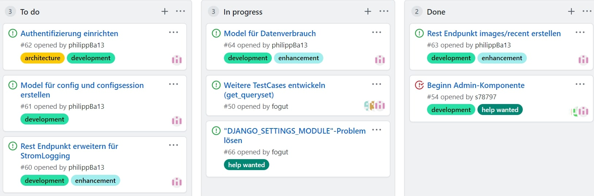
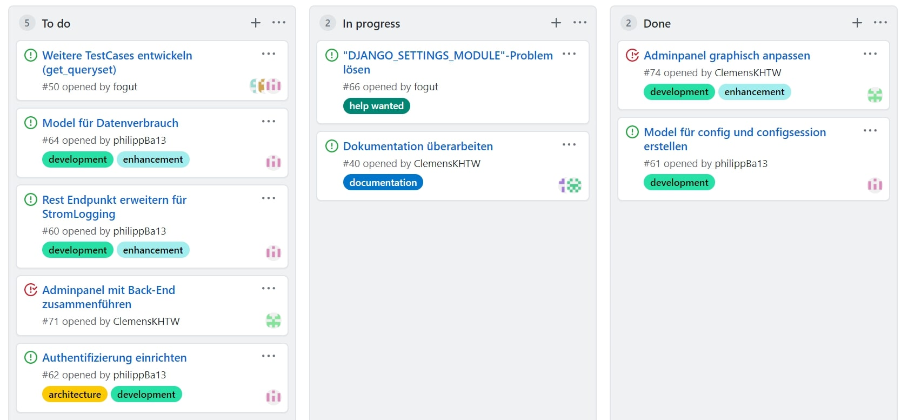
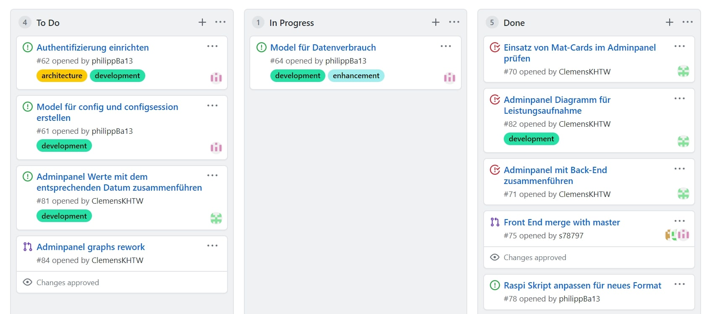
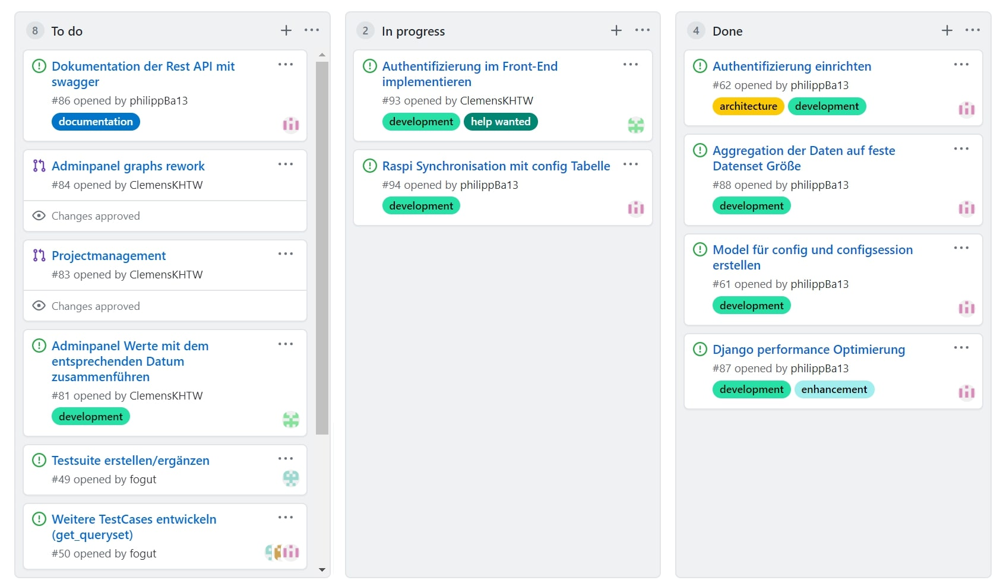

== Projektplanung

Das Projekt wurde in Iterationen mit einer Iterationslänge von 2 Wochen durchgeführt. 
Dabei kann das Projekt grob in 2 Phasen untergliedert werden. 
Die erste Phase ist die der Analyse und Projektplanung im WiSe 19/20, die zweite Phase ist die der Implementierung im SoSe 20, wobei im Sinne der Iterativen Entwicklung keine strikte Trennung erfolgte. 
Die Iterationen wurden mit Ablauf der vorhergehenden angefangen, 2 Wochen lang bearbeitet und mit einem Meeting abgeschlossen, bei dem möglichst das gesamte Team anwesend sein sollte. Während des Meetings wurde dann die neue Iteration geplant. 
Im folgenden sind ausgewählte Ziele, Aktivitäten, Ergebnisse und Probleme der Iterationen aufgelistet und verantwortliche Rollen spezifiziert. Dabei sind nicht alle Aktivitäten und Ergebnisse dargestellt, sondern nur die wichtigsten und/oder Beispiele (d.h. es werden hier nicht alle ausgearbeiteten Wireframes, Use-Cases, ERMs, ... dargestellt).
//Was wurde gemacht, was ist dabei herausgekommen, Zwischenergebnisse präsentieren

== Iterationen

=== Iteration 1 - 28.11.2019-11.12.2019
==== Ziele / Aktivitäten
- Team zusammensetzen -> Alle
- Arbeitsweise und Tools zur Teamarbeit heraussuchen -> Alle

==== Ergebnisse
- Team zusammengesetzt, Kommunikation per WhatsApp etabliert
- Git für Versionsverwaltung festgelegt, inklusive GitHub-Issues

=== Iteration 2 - 12.12.2019-25.12.2019
==== Ziele / Aktivitäten
- Anforderungen im Kundengespräch aufnehmen -> Analyst, Entwickler, Projektmanager
- Stakeholder finden -> Alle

==== Ergebnisse
- Anforderungen aufgenommen und einige Stakeholder gefunden

=== Iteration 3 - 26.12.2019-09.01.2020
==== Ziele / Aktivitäten
- Use-Cases ableiten -> Analyst, Architekt, Tester
- Vision bearbeiten -> Architekt, Projektmanager
- Glossar anlegen -> Alle
- Basisarchitektur skizzieren -> Architekt

==== Ergebnisse
.Skizze der Architektur
image::images/I3-Architektur.jpg[]

==== Probleme
- Teaminterne Kommunikation mangelhaft, d.h. es wurde sich nicht über offene Aufgaben informiert und die Erledigung von Aufgaben wurde nicht kenntlich gemacht (wer mach gerade was, Issues wurden nicht genutzt)

=== Iteration 4 - 10.01.2020-22.01.2020
==== Ziele / Aktivitäten
- Geregelte Kommunikation im Team durchsetzen -> Projektmanager
- Use-Cases ableiten und teils detailliert ausarbeiten -> Analyst, Architekt, Entwickler, Tester
- ERM erarbeiten -> Architekt, Entwickler
- Aktivitätsdiagramme erarbeiten -> Architekt, Entwickler

==== Ergebnisse
.Kommunikation der Komponenten
image::images/I4-db.jpg[]

==== Probleme
- Work Items List wurde von den Teammitgliedern nicht angenommen

=== Iteration 5 - 23.01.2020-05.02.2020
==== Ziele / Aktivitäten
- Use-Cases überarbeiten -> Analyst, Architekt, Entwickler, Tester
- Wireframes erstellen und Kunden vorzeigen
- Belegabgabe vorbereiten/durchführen -> Projektmanager

==== Ergebnisse
.Wireframe für die Graphenansicht
image::images/I5-graphwire.jpg[]

==== Probleme
- Work Items List wurde von den Teammitgliedern nicht angenommen

=== Iteration 6 - 06.02.2020-19.02.2020
- Pause aufgrund der Prüfungszeit  

=== Iteration 7 - 20.02.2020-04.03.2020
- Pause aufgrund der Prüfungszeit und Winterferien

=== Iteration 8 - 05.03.2020-18.03.2020
- Pause aufgrund von Winterferien

=== Iteration 9 - 19.03.2020-01.04.2020
==== Probleme
- Pandemie  

=== Iteration 10 - 02.04.2020-21.04.2020
==== Ziele / Aktivitäten
- Rollenverteilung anpassen -> Projektmanager
- Erste Programmierungen vornehmen 

==== Ergebnisse
- Rollenverteilung im Team geregelt
- Werte können in eine Datenbank gespeichert und über einen Browser ausgelesen werden mittels Rest-API

==== Probleme
- Mangelnde Kommunikation mit GitHub-Issues

=== Iteration 11 - 22.04.2020-06.05.2020
==== Ziele / Aktivitäten
- Front-End und Back-End entwickeln -> Architekt, Entwickler
- Test auf Grundlage von Use-Cases beschreiben und entwickeln -> Tester

==== Ergebnisse
.Bewertung
image::images/bewertung_iteration.jpg[]

=== Iteration 12 - 07.05.2020-20.05.2020 
==== Ziele / Aktivitäten
- Front-End, Back-End und Bildergallerie weiterentwickeln -> Entwickler, Architekt
-Testsuite aufbauen und damit erste Tests implementieren -> Tester

==== Ergebnisse
- Bilder in der Bildergallerie können geladen und dargestellt werden
- Front-End und Back-End erweitert 
- Der momentane Projektstand/-verlauf wird vom Kunden für zufriedenstellend befunden

=== Iteration 13 - 21.05.2020-03.06.2020
==== Ziele / Aktivitäten
- Rest Endpunkt images/recent erstellen -> Architekt
- Rest Endpunkt erweitern für StromLogging -> Architekt
- Authentifizierung einrichten -> Architekt
- Model für config und configsession erstellen -> Architekt

==== Ergebnisse
.Iteration 13

=== Iteration 14 - 04.06.2020-17.06.2020
==== Ziele / Aktivitäten
- Rest Endpunkt erweitern für StromLogging -> Architekt
- Model für Datenverbrauch -> Architekt
- Model für config und configsession erstellen -> Architekt
- Authentifizierung einrichten -> Architekt

==== Ergebnisse
.Iteration 14

=== Iteration 15 - 18.06.2020-01.07.2020
==== Ziele / Aktivitäten
- Model für config und configsession verfeinern (WIP) -> Architekt
- Admin Panel bearbeiten -> Projektmanager
- Authentifizierung einrichten -> Architekt

==== Ergebnisse
.Iteration 15

==== Probleme
- Projektbericht und Dokumentation wurden nicht überarbeitet
- Modell für Config und Configsession wurde nicht verfeinert

=== Iteration 16 - 02.07.2020-15.07.2020
==== Ziele / Aktivitäten
- Tests erstellen, überarbeiten und durchführen -> Tester, Architekt
- Model für config und configsession verfeinern -> Architekt
- Gallerie bearbeiten -> Entwickler
- Admin-Panel Diagram Daten mit entsprechenden Datumsangaben zusammenführen -> Projektmanager
- Authentifizierung einrichten -> Architekt

==== Ergebnisse
.Iteration 16

