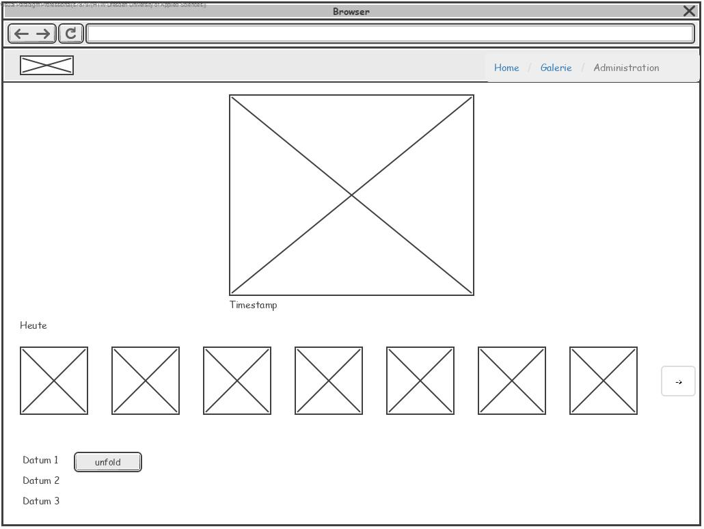
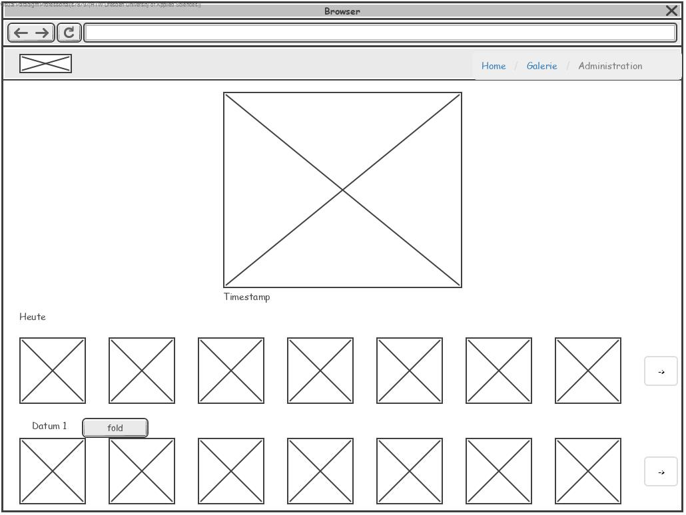

//Nutzen Sie dieses Template als Grundlage für die Spezifikation *einzelner* Use-Cases. Diese lassen sich dann per Include in das Use-Case Model Dokument einbinden (siehe Beispiel dort).
== Use Case: Bildergalerie abrufen
===	Kurzbeschreibung
//<Kurze Beschreibung des Use Case>
In diesem Use-Case wird die Anzeige und das Bearbeiten der aufgenommenen Bilder behandelt.

===	Kurzbeschreibung der Akteure
==== User
User können sich die Bilder anschauen, welche in einer Galerie auf der Website des MFCR zur Verfügung gestellt werden.

==== Admins
Admins können sich diese Bilder ebenfalls anzeigen lassen, haben aber erweiterte Rechte, um Bilder zu bearbeiten, zu kopieren, zu verschieben oder zu löschen.

=== Vorbedingungen
//Vorbedingungen müssen erfüllt, damit der Use Case beginnen kann, z.B. Benutzer ist angemeldet, Warenkorb ist nicht leer...
. Die Kamera hat bereits Bilder aufgenommen
. Die Bilder werden korrekt auf den Server gepusht und dazugehörige Meta-Daten in der DB gespeichert
. Die Bilder werden vom Server richtig zum Client übertragen

=== Standardablauf (Basic Flow)
//Der Standardablauf definiert die Schritte für den Erfolgsfall ("Happy Path")

. Der Use Case beginnt, wenn der User/Admin die Website mit der Bildergalerie aufruft
. Die Bilder werden in aufgenommener Reihenfolge als Galerie angezeigt, das aktuellste Bild wird größer dargestellt
. Beim Klicken auf ein anderes Bild wird die Auswahl an die Bildschirmgröße des Nutzers angepasst dargestellt
. Die Bilder laden nach unten weiter, wenn der User weiter nach unten scrollt 
. Der User/Admin kann einen Zeitraum angeben, in dem die aufgezeichneten Bilder angezeigt werden sollen
. Der Use Case ist abgeschlossen.

=== Alternative Abläufe
//Nutzen Sie alternative Abläufe für Fehlerfälle, Ausnahmen und Erweiterungen zum Standardablauf
==== Bildfehler
Wenn der User/Admin im Schritt 1 des Standardablauf die Website aufruft, dann kann es sein, dass ein oder mehrere Bilder nicht richtig verarbeitet wurden

. Der Admin loggt sich ein und kann die entsprechenden Bilder bearbeiten oder löschen.  
. Der Use Case wird im Schritt 1 des Standartablaufes fortgesetzt.

==== Zeitraumfehler
Wenn der User/Admin im Schritt 4 des Standardablauf einen ungültigen Zeitraum angibt, dann wird er gebeten den Zeitraum zu ändern.

. Der User/Admin gibt einen Zeitraum an, in dem keine Bilder aufgezeichnet wurden.
. Der Server greift auf die Datenbank zu und stellt fest, dass es keine Bilder im angegebenen Zeitraum gibt.
. Dem User/Admin wird die Meldung angezeigt, dass er den Zeitraum ändern soll und wann das erste und das letzte Bild aufgezeichnet wurden.
. Der Use Case wird im Schritt 4 Standardablaufes fortgesetzt.

=== Unterabläufe (subflows)
//Nutzen Sie Unterabläufe, um wiederkehrende Schritte auszulagern

==== Zeiträume
. Der User/Admin kann einen Zeitraum angeben, um nach Bildern in diesem zu filtern
. Der Server greift auf die Datenbank zu
. Die Website generiert die Galerie dem entsprechenden Zeitraum nach neu
. Der Subflow ist abgeschlossen

=== Wesentliche Szenarios
//Szenarios sind konkrete Instanzen eines Use Case, d.h. mit einem konkreten Akteur und einem konkreten Durchlauf der o.g. Flows. Szenarios können als Vorstufe für die Entwicklung von Flows und/oder zu deren Validierung verwendet werden.
==== Bilder bearbeiten/löschen/kopieren
Wenn der Admin sich eingeloggt hat, hat er die Möglichkeit in Schritt 1 die Bilder von der Website zu löschen oder diese herunterzuladen, um sie lokal zu bearbeiten oder zu sichern.

===	Nachbedingungen
//Nachbedingungen beschreiben das Ergebnis des Use Case, z.B. einen bestimmten Systemzustand.
==== Galerieanzeige
Die Website hat die Galerie entsprechend der User/Admin-Anforderungen geladen und wartet auf neue Änderungen (weitere Bilder laden, Zeitraumänderung, Bilder löschen), um die Galerie dementsprechend neu zu generieren

=== Besondere Anforderungen
//Besondere Anforderungen können sich auf nicht-funktionale Anforderungen wie z.B. einzuhaltende Standards, Qualitätsanforderungen oder Anforderungen an die Benutzeroberfläche beziehen.
==== Qualitätsanforderung
Sollte ein Admin ein Bild löschen, muss die Website die Galerie ohne dieses Bild weiterhin ordnungsgemäß und lückenlos anzeigen können.

=== Wireframes

.Wireframe Galerie 1

.Wireframe Galerie 2

