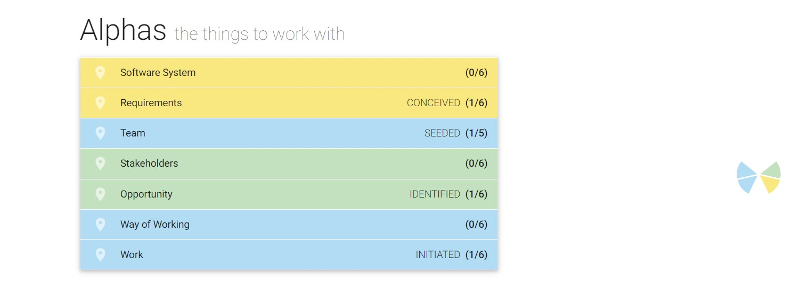

= Projektplan Wetterstation

== Einführung
Dieses Dokument gibt einen Überblick über das Projekt Wetterstation. Es wird das Projektteam, eingesetzte Tools/Techniken, Risiken und Iterationen vorgestellt.

== Das Team
- Hannes Fogut       : Tester, Entwickler
- Josefin Hähne      : Analyst, Architekt
- Philipp Barth      : Architekt, Entwickler
- Justin Schirdewahn : Entwickler, Tester
- Alexander Schoch   : Entwickler, Projektmanager
- Clemens Kujus      : Projektmanager, Analyst
- Agustin Calvimontes: Deployment Engineer, Technical Writer

Nach der ersten Iteration wurden die Hauptrollen von Martin Großmann (ehemals Projektmanager) und Clemens Kujus (ehemals Tester) getauscht. Martin Großmann hat das Team iin SE2 verlassen und dafür ist Hannes Fogut hinzugekommen.

== Kommunikationswege
. WhatsApp für schnelle Kommunikation
. GitHub-Issues für Themenbearbeitung
. E-Mail für Kontakt mit den Kunden/Coach
. Regelmäßige Treffen im Team (nach Bedarf mit Kunde/Coach)
. Kontakt im Alltag an der HTW -> Entfällt in SE2

== Projektablauf
Das Projekt ist in einer Zeitspanne von Dezember 2019 bis August 2020 gestreckt. Dabei gibt es zwei große Etappenziele. Im ersten Semester steht die Analyse und Projektplanung im Vordergrund, im zweiten Semester die Implementierung, wobei natürlich im Sinne der iterativen Entwicklung keine strikte Trennung der Aufgaben erfolgt.

Die Iterationslänge beträgt 2 Wochen. Diese werden geplant, durchgeführt und ausgewertet, wobei nach Abschluss einer Iteration im Team auf deren Basis die nächste Iteration geplant wird.

== Meilensteine und Ziele
[#Iterationen]
[cols="1,3,1" options="header"]
|===
|Iteration
|Primary Objectives
|Scheduled start
|I-2
|- Anforderungen des Kunden anhand des Gesprächs genauer spezifieren

 - Stakeholder finden 

 - Use Cases ableiten und grob beschreiben

 - Vision bearbeiten
|12.12.2019
|I-3
|- Stakeholder finden 

 - Use Cases ableiten und einen Teil davon detailliert ausarbeiten

 - Vision bearbeiten

 - Glossar anlegen/bearbeiten

 - 2. Kundengespräch vorbereiten/durchführen
|26.12.2019
|I-4
|- Eine geregelte Kommunikation der Aufgabenteilung durchsetzen und anwenden (Work-Items-List, Git-Issues)

 - Use Cases ableiten und einen großteil davon detailliert ausarbeiten

 - Wireframes erstellen/bearbeiten

 - Verbindung zum Raspberry Pi testen 

 - Erste Funktionalität gemäß Auftraggeber, d.h. Simulation von Messwerten, erarbeiten

 - ERM (database model) bearbeiten

 - Aktivitätsdiagramme zu komplexen Abläufen erarbeiten

 - Links (Linkliste vom Auftraggeber) durchgehen und relevante Inhalte raussuchen
|09.01.2020
|I-5
|- Überarbeiten der Dokumentationsdokumente

 - Design-Dokument erstellen

 - Belagabgabe vorbereiten/durchführen

 - Git-Repo "aufräumen"
|23.01.2020
|I-6/I-7
|Pause aufgrund der Prüfungszeit
|06.02.2020
|I-8
|- Rollenverteilung regeln

- erste Programmierungen vornehmen
|05.03.2020
|I-10
|- Rollenverteilung regeln

- erste Programmierungen vornehmen

- Im Treff mit dem Kunden Entwurf absprechen
|02.04.2020
|I-11
|- Front-End mit grundsätzlichen Funktionen ausstatten -> Alex

- Front-End und Back-End zusammenführen -> Alex, Philipp, Justin

- Datenformat der Wetterdaten festlegen -> Alex, Philipp, Justin

- Rest-API vervollständigen, Authentifizierung regeln -> Philipp

- Dokumentation überarbeiten -> Josefin

- Aufgaben des Technical Writer/Deployment Engineer auf das Projekt abbilden -> Agustin

- Test auf Grundlage von Use-Cases beschreiben und entwickeln -> Hannes

- Projektabgabe spezifizieren (welche Dokumente nötig etc.) -> Clemens
|22.04.2020
|I-12
|- Front-End weiterentwickeln, v.a. die Bildergalerie -> Alex

- Back-End auf die Datenstruktur anpassen und weiterentwickeln -> Philipp, Justin

- Testsuite aufbauen und damit erste Tests implementieren -> Hannes

- Dokumentation weiter überarbeiten -> Josefin
|07.05.2020
|I-13
|- Front-End weiterentwickeln -> Alex, Justin, Clemens

- Dokumentation überarbeiten und von den Teammitgliedern fordern -> Josefin

- Testfälle spezifizieren und entsprechend implementieren -> Hannes

- Rest Endpunkt images/recent erstellen -> Philipp

- Rest Endpunkt erweitern für StromLogging -> Philipp

- Model für Datenverbrauch -> Philipp

- Authentifizierung einrichten -> Philipp

- Model für config und configsession erstellen -> Philipp
|21.05.2020
|I-14
|- Dokumentation überarbeiten und von den Teammitgliedern fordern -> Josefin

- Rest Endpunkt erweitern für StromLogging -> Philipp

- Model für Datenverbrauch -> Philipp

- Model für config und configsession erstellen -> Philipp

- Testfälle implementieren -> Hannes

- Winddaten für das Front-End bereits im Back-End zur Verfügung stellen -> Philipp

- Graphen, Pfeile und erweiterten Modus im Front-End überarbeiten -> Alex

- Bildergalerie implementieren -> Justin

- Einsatz von Mat-Cards im Adminpanel prüfen -> Clemens

- Authentifizierung einrichten -> Philipp
|04.06.2020
|I-15
|- Projektbericht bearbeiten, Dokumentationen einfordern -> Josefin, Agustin

- Rest Endpunkt erweitern für StromLogging -> Philipp

- Model für config und configsession verfeinern (WIP) -> Philipp

- Tabelle für Windrichungen (der letzten 24h) implementieren-> Alex

- Gallerie bearbeiten -> Alex, Justin

- CSS Revision Graphen-Komponente

- Admin Panel bearbeiten -> Clemens

- Authentifizierung einrichten -> Philipp
|18.06.2020
|===

== Fortschritte nach Sim4Seed

Iteration 2:

[#img-ip2]
.Fortschritt Iteration 2

Iteration 3:

[#img-ip3]
.Fortschritt Iteration 3
image::images_project_status/Iteration_3.jpg[]

Iteration 4:

[#img-ip2]
.Fortschritt Iteration 4

Iteration 13:

[#img-ip2]
.Fortschritt Iteration 13
image::images_project_status/Iteration_13.jpg[]

Iteration 14:

[#img-ip2]
.Fortschritt Iteration 14
image::images_project_status/Iteration_14.jpg[]

Iteration 15:

[#img-ip2]
.Fortschritt Iteration 15
image::images_project_status/Iteration_15.jpg[]

== Eingesetzte Tools/Techniken
- Arbeitsweise nach dem https://www2.htw-dresden.de/~anke/openup/index.htm[Open Unified Process]
- GitHub für Versionsverwaltung/Issues
- Visual Paradigm für Diagramme 

== Deployment
Hauptverantwortlicher für das Deployment ist Agustin Calvimontes

== Risk List
include::Risk_List.adoc[]

