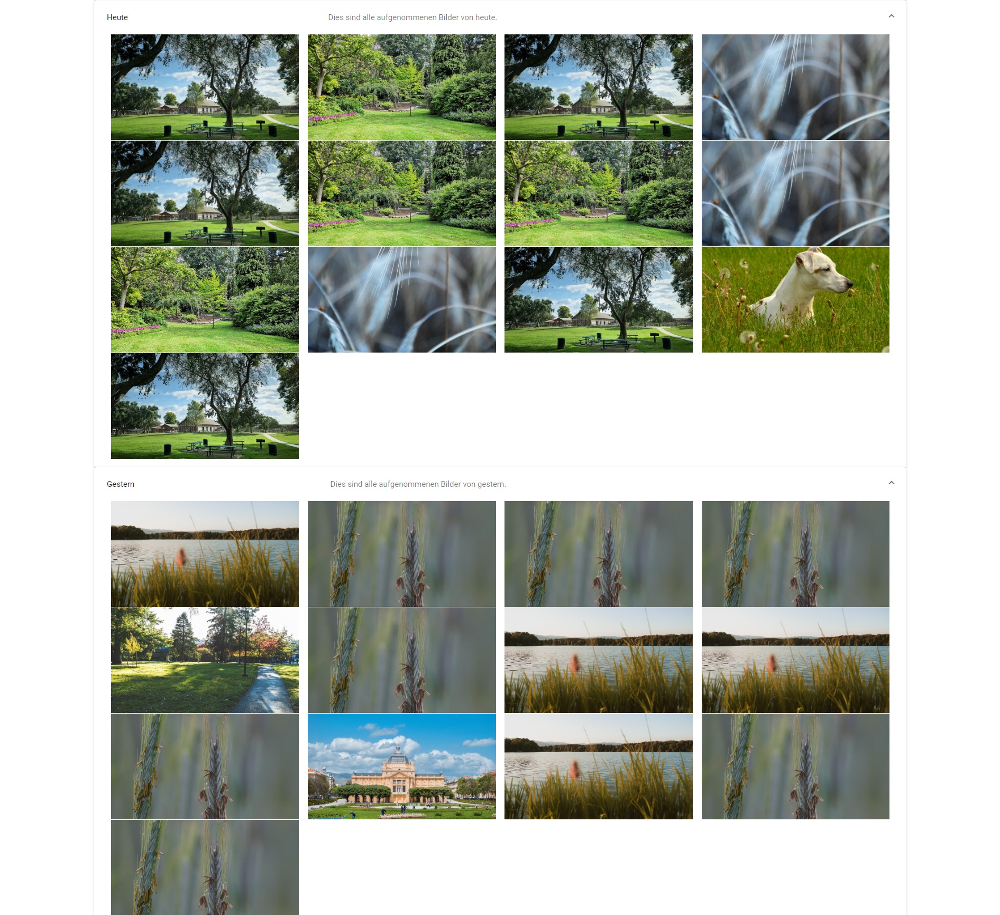
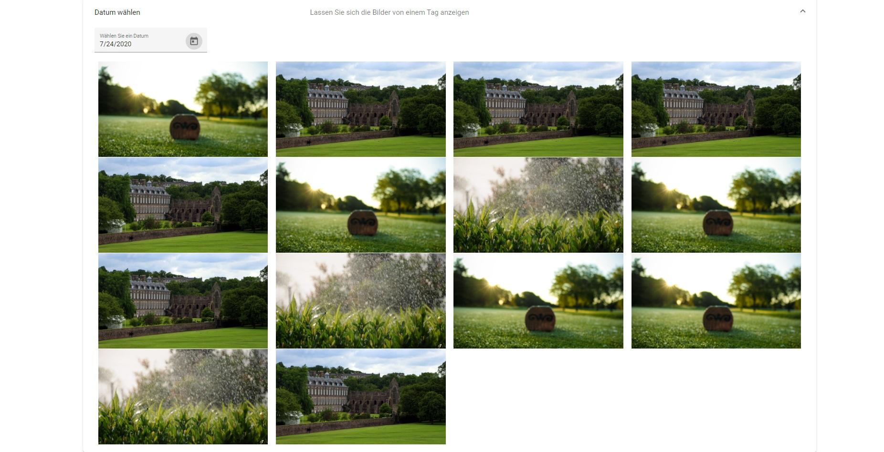
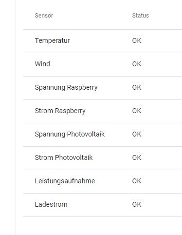

= Anwenderdokumentation Software zur Fernabfrage von Kamerabild und Wetterdaten

:toc: 
:toc-title: Inhaltsverzeichnis
:sectnums:

== Einführung
Der Zweck dieser Anwenderdokumentation ist es, den Nutzer bei der Bedienung des Systems zu unterstützen und bei möglichen Fragen weiterzuhelfen. 

Das System dient zur Abgfrage von Wetterdaten und Kamerabildern auf dem Modellflugplatz des Modellflugclubs Rossendorf e.V. auf der Vereinswebsite. 
Zu den Wetterdaten gehören die Temperatur, die Windgeschwindigkeit und die aktuelle Windrichtung. In der Galerie werden aktuelle und ältere Bilder angezeigt.
In dem internen Wartungsbereich werden der Energieverbauch von Akku, Solarzelle und Raspberry sowie der Datenverbrauch, eine Sensorpüfung und die Konfigurationstabelle abgefragt. Um zu diesen Daten Zugang zu haben, muss man ein Nutzer Zugriffsrechte haben und sich anmelden. 

== Aufbau
Das System besteht aus einem öffentlichen Bereich, der für alle Nutzer zugänglich ist und einem internen Bereich, der nur für bestimmte Nutzer erreichbar ist. Es ist in drei Bereiche gegliedert: Graphen, Webcam & Galerie und Wartungsbereich.

=== Graphen
Bei den *Graphen* werden oben die aktuellen Daten von Temperatur, Windgeschwindigkeit und -richtung angezeigt. Darunter befinden sich die Windrichtungen der letzten 3 Stunden, das Diagramm für die Windgeschwindigkeiten und die Temperaturen. Bei den Temperaturen gibt es links eine Auswahl der Anzahl der Tage, die angezeigt werden sollen und an der rechten Seite kann man den erweiterten Modus aktivieren. Wenn dieser aktiv ist, kann links in einem Suchfeld nach den Wetterdaten zu einem bestimmten Zeitpunkt oder Zeitraum gesucht werden.

image::Screenshot_wetter.jpg[Graphen]

=== Webcam/Galerie
In dem Tab *Webcam/Galerie* werden die aufgenommenen Bilder angezeigt. Dabei wird das aktuelle Bild groß angezeigt und darunter ältere Bilder kleiner. Die Bilder sind nach Tagen sortiert und darunter kann auch nach Bildern von einem bestimmten Datum gesucht werden.

image::gallery2.jpg[Galerie]

=== Wartungsbereich
Im *Wartungsbereich* wird zuerst die Anmeldung angezeigt, welche aus Benutzernamen und Passwort besteht. Darunter befindet der Button zur Anmeldung. Danach besteht er aus den Tabs Solarzelle, Akku, Raspberry und Datenverbrauch. Darin werden in Diagrammen jeweils die Spannung und die Leistung von Solarzelle, Akku und Raspberry dargestellt. Unten auf den Seiten die Konfigurationstabelle und die Sensorenstatus von Temperatur, Wind, Spannung Raspberry, Strom Raspberry, Spannung Photovoltaik, Strom Photovoltaik, Leistungsaufnahme und Ladestrom angezeigt. 
Der Datenverbrauch wird auch in einem Diagramm dargestellt.  

image::login.jpg[Login]

== Nutzung
=== häufig genutzte Funktionen, für alle Nutzer
==== Wetterdaten abrufen
Im Tab Graphen kann man die aktuellen Wetterdaten einsehen, sowie auch den Verlauf. Die Temperatur und Windgeschwindigkeit wird dabei in einem Graphen dargestellt.

image::Screenshot_wetter1.jpg[aktuelle Wetterdaten]
image::Screenshot_wetter2.jpg[Verlauf der Windrichtung]
image::Screenshot_wetter3.jpg[Verlauf der Windgeschwindigkeit]
image::Screenshot_wetter4.jpg[Verlauf der Temperatur]

Durch Bewegen des Reglers für den erweiterten Modus wird dieser aktiviert und es kann eine Zeit ausgewählt werden, in der man die Temperaturen sucht. 

image::wetter2.jpg[erweiterter Modus]

==== Bilder ansehen
In dem Tab Webcam/Galerie erscheinen als erstes aktuelle Bilder, davon das letzte groß. Darunter befinden sich die Bilder der Tage zuvor, welche durch klicken auf den Pfeil rechts ausgeklappt werden.

image::gallery2.jpg[aktuelle Bilder anzeigen]

Wenn man auf ein Bild klickt wird es größer in einer Lightbox angezeigt.

image::gallery.jpg[Lightbox]

Mithilfe der Suchfunktion kann nach Bildern eines bestimmten Datums gesucht werden. Dazu wird das Suchfeld angeklickt und anschließend auf ein Datum.

=== selten genutzte Funktionen, für Administratoren
Um diese Funktionen zu nutzen muss in den Tab Wartungsbereich gewechselt werden. Anschließend muss man sich anmelden. Dazu gibt man seinen Benutzernamen und Passwort ein und bestätigt die Anmeldung mit dem Button 'anmelden'.

image::login.jpg[Anmeldung]

==== Logtabelle ansehen
Die Logtabelle befindet sich jeweils in den Tabs.
Dort können die Daten angesehen werden.

image::admin_panel2.jpg[Logtabelle]

==== Datenverbrauch abrufen
Es muss in den Tab Datenverbrauch gewechselt werden.Dort wird der tägliche Verbrauch im aktuellen Monat bis zum aktuellen Tag im Diagramm dargestellt. Der gesamte Verbrauch des aktuellen Monats kann darunter abgelesen werden. Eine weitere Möglichkeit besteht darin, sich eine Zeitspanne auszuwählen, in der der Datenverbrauch abgelesen werden möchte.

==== Status der Sensoren abfragen
Die Status werden jeweils in den Tabs angezeigt und es können die Daten angesehen werden.

==== Informationen zum Energieverbrauch des Akkus abfragen
Dazu in den Tab Akku wechseln und die Spannung und Leistung ablesen.

==== Informationen zum Energieverbrauch der Solarzelle abfragen
Dazu in den Tab Solarzelle wechseln und die Spannung und Leistung ablesen.

image::admin_panel1.jpg[Spannung und Leistung der Solarzelle]

==== Informationen zum Energieverbrauch des Raspberrys abfragen
Dazu in den Tab Raspberry wechseln und die Spannung und Leistung ablesen.